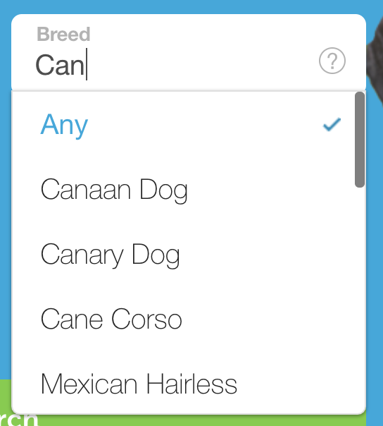

### Setup steps

Fork this repo, and then do the following:

1. Using [vue/cli](https://cli.vuejs.org/) initialize a new project in this repo. Make sure to add unit testing, Sass, and ESLint support
1. Install and use the [Adoptapet eslint plugin](https://github.com/adopt-a-pet/eslint-plugin-adoptapet) for the project
1. Create a component in the `components` folder called `Autosuggest.vue`. Configure `App.vue` to render `<Autosuggest>` in its template.

### Now, here is your task:

If you go onto [adoptapet.com](https://www.adoptapet.com) you'll see the main search form includes a field where you can select a breed. Notice if you start typing in the field it will narrow the list for you. Right now that fuzzy match is implemented using [Fuse](http://fusejs.io). Your task is to re-create a similar functionality without using any libraries to assist you.

### Here are some tips that should help

1. It doesn't have to be a fuzzy match. It can just be an exact match of the user's input up to that point. For example, if a user types "can" it only has to match "Canaan Dog", "Canary Dog", and "Cane Corso". It does _not_ have to also match "Mexican Hairless" (which includes "can" but not at the beginning of the word).
1. Consider using a [Radix Tree](https://medium.com/basecs/trying-to-understand-tries-3ec6bede0014) or a [Ternary search tree](https://en.wikipedia.org/wiki/Ternary_search_tree). You can use any algorithm you want, but whatever you choose, you will have to explain why you chose that algorithm.
1. It doesn't have to look like the drop-down on adoptapet.com. Don't worry about making the "?" tooltip. If you want to add your own style to it, please do. Bonus points for making it look better than ours!
1. High-level functionality is most important. For example, it can be a bit tricky to get the drop down to highlight your currently-selected value. It's a lot easier to _not_ keep track of the user's selection, but instead to just populate the input field with the text value. If you're running short on time, remember that overall functionality is most important.
1. You can find the list of breeds [here](https://ra-api.adoptapet.com/v1/pet-utilities/1/breeds). If you prefer cats, you can use `.../2/breeds`.

### Additional rules:

1. You must make an API request to load the breeds (can't be from a static file)
1. No CSS frameworks. Since this is such a simple task, you should only need a few classes and we would like to see how you do without the help of the framework. Feel free to use Sass if you want a preprocessor.

### Bonus points if...
1. Your class names use the BEM naming convention
1. Your autocomplete algorithm is covered by unit tests

Best of luck!
